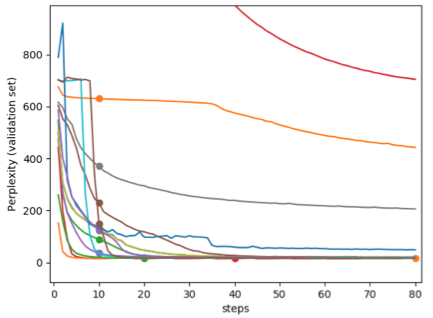

# Training with different optimizers

The purpose of this simple tutorial is to demonstrate different optimizers in Sockeye/MxNet. Note the hyperparameters are not tuned for this dataset, but simply are for illustration purposes. 

We will use the data in `egs/ted/de-en/data-bpe`. Make sure it is present by following the instructions in [egs/ted/README.md](../ted/README.md), then: 

```bash
0_link_data.sh
```

We will use the rs1 model as template, and try the various `*.hpm` files in this directory. For example, train all the models:

```bash
for hpmfile in `ls *.hpm` ; do
    qsub -S /bin/bash -V -cwd -q gpu.q -l gpu=1,h_rt=24:00:00,num_proc=2,mem_free=20G -j y path/to/sockeye-recipes/scripts/train.sh -p $hpmfile -e sockeye_gpu ; 
done
```

After training finishes (or a few checkpoints have passed), you can see the learning curves at http://localhost:26006

```bash
source activate sockeye_cpu
tensorboard --logdir . --port 26006
```

You should see something like this:


An example of the final perplexities of each model can be seen in [metrics_example.txt](metrics_example.txt). In this example, note that rs1-eve1, rs1-nadam2, rs1-rmsprop2 achieve good validation perplexity values. Your results may vary if using a different dataset. In particular, learning rate is important, as seen in differences between e.g. rs1-eve1 vs rs1-eve2. There are also differences due to random initialization, comparing e.g. rs1-adam2 adn rs1-adam2b. The lesson is to try various settings with these optimizers a bit for your own dataset. 


